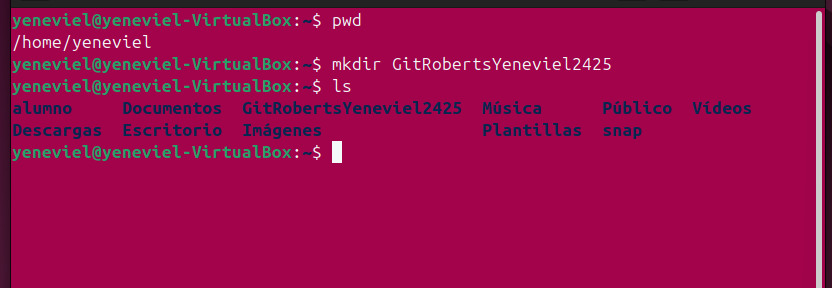

##**Actividad: Remoto y repaso de comando anteriores**

*Acividad en la cual repasamos el uso de diferentes ramas en git desde la terminal
con comandos como git branch, git checkout... com tambien el uso del lenguaje 
MARKDOWN.*

####**¿Qué es gitignore y para qué sirve?**
Es un archiv que podemos usa para evitar ncluir archivos no deseados en
nuestro git repositorio.
# Pr-ctica-3---GitHub-y-repositorio-remoto

####**¿Qué pasa al crear un repositorio con un archivo README.md?**
*Se creaun reposotorio con el archivo README:md y aparece como título dentro
del readme elnombre del repositorio.*

####**¿Qué pasa al crear un repositorio sin el archivo README.md?**
*Se crea un repositorio vacio,sin ningun archivo. Además te dice las opciones
 que puedes elegir para agregar archivos al repositorio.*

####**Comando que me da Git Hub al crear un repositorio nuevo**
-echo "# Pr-ctica-3---GitHub-y-repositorio-remoto" >> README.md
-git init
-git add README.md
-git commit -m "first commit"
-git branch -M main
-git remote add origin https://github.com/yenevielroberts/Pr-ctica-3---GitHub-y-repositorio-remoto.git
-git push -u origin main
####*Comands alias que he usado*
Mi comando a es igual a git add . 
comando s es igual a git status --short
comando log es igual a git log

###Parte1: preparación del proyecto

Creacion de la carpeta GitRobertsYeneviel2425 con el comndo mkdir

