##**Actividad: Remoto y repaso de comando anteriores**

*Acividad en la cual repasamos el uso de diferentes ramas en git desde la terminal
con comandos como git branch, git checkout... com tambien el uso del lenguaje 
MARKDOWN.*

####**¿Qué es gitignore y para qué sirve?**
Es un archiv que podemos usa para evitar ncluir archivos no deseados en
nuestro git repositorio.
# Pr-ctica-3---GitHub-y-repositorio-remoto

####**¿Qué pasa al crear un repositorio con un archivo README.md?**
*Se creaun reposotorio con el archivo README:md y aparece como título dentro
del readme elnombre del repositorio.*

####**¿Qué pasa al crear un repositorio sin el archivo README.md?**
*Se crea un repositorio vacio,sin ningun archivo. Además te dice las opciones
 que puedes elegir para agregar archivos al repositorio.*

####**Comando que me da Git Hub al crear un repositorio nuevo**
-echo "# Pr-ctica-3---GitHub-y-repositorio-remoto" >> README.md
-git init
-git add README.md
-git commit -m "first commit"
-git branch -M main
-git remote add origin https://github.com/yenevielroberts/Pr-ctica-3---GitHub-y-repositorio-remoto.git
-git push -u origin main
####*Comands alias que he usado*
Mi comando a es igual a git add . 
comando s es igual a git status --short
comando log es igual a git log

###Parte1: preparación del proyecto

-Creacion de la carpeta GitRobertsYeneviel2425 con el comando mkdir

-Creación de la carpeta src con el comndo mkdir

-Creación del archivo README.md con el comando cat
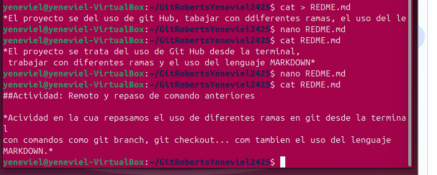

-Inicialización del repositorio con el comando git init
-Creación del archivo .gitignore con el comando touch
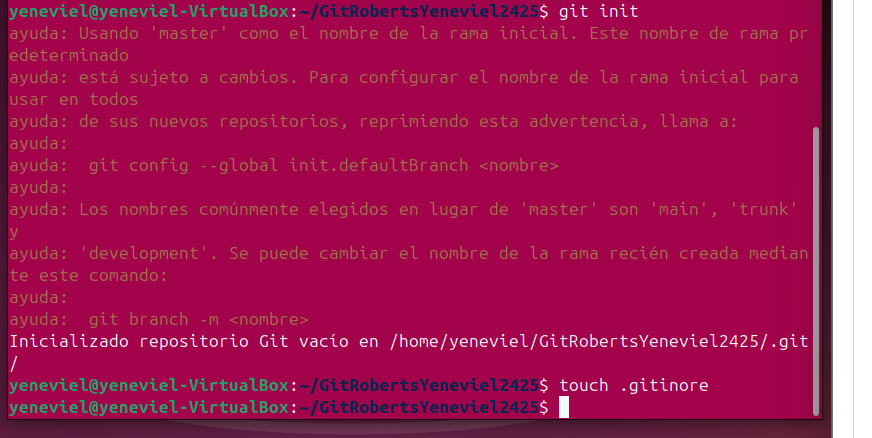

-Configuración delarchivo ,gitignore
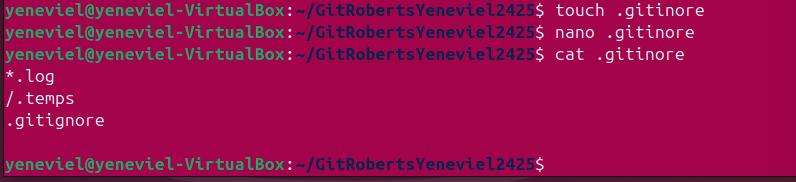

-Creación de los archivos index.hmtl, style.css y main.js con el comando
touch.
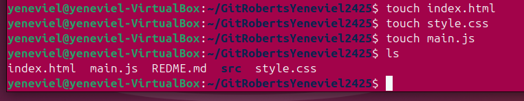

-Primer git add y commit

###Parte 2: colaboración en equipo

-Entra en git hub y crea un repositorio
-Repositorio con archivo readme

-repositorio sin archivo readme
![creacion-del-repositorio-sin-readme.png]

-Vinculación del repositorio remoto con el local con los comandos:
git add remote url
git push origin main

-Creación de la rama feature/documentacion con el comando git branch
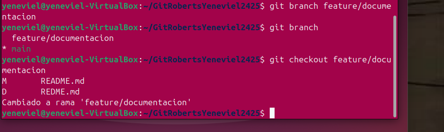

-Creación del archivo docs.md con el comando touch

-Primer commit en la rama feature/documentacion con el comando git commit -m""
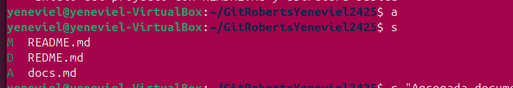
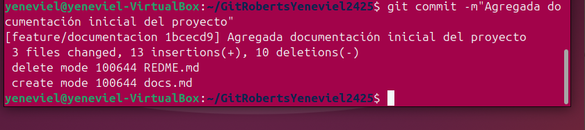

-Git pull desde la rama main con el comando git pull origin main
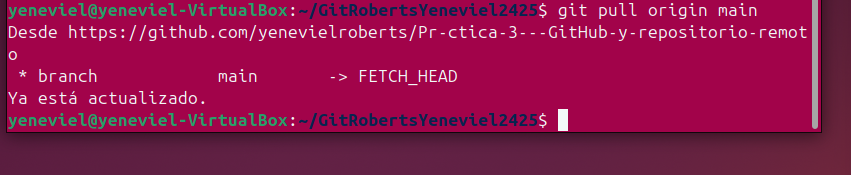

-Creación del archivo src/app.py con el comando cat
-Git add y commit con los comandos git add . git commit -m""
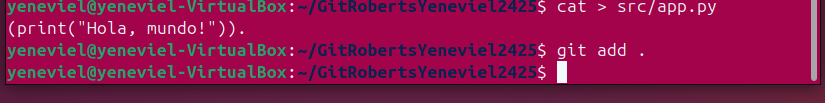

-Visualización del historial de commit con log con un alias

-Eliminación del archivo src/app.py con el comando rm -f
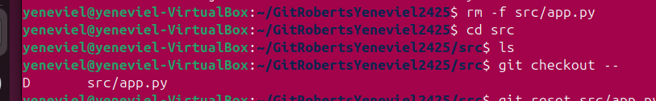

-Recuperación del archivo eliminado con el comando git restore

-Merge de las ramas desde la rama main con el comando git checkout main y luego git merge feature/documentacion
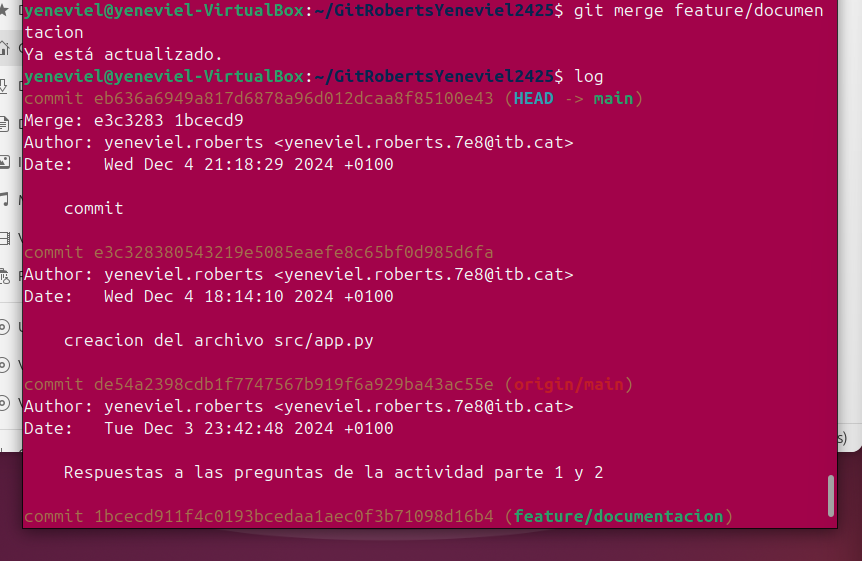

-Verificar los cambios realizados y el historial con el alias log
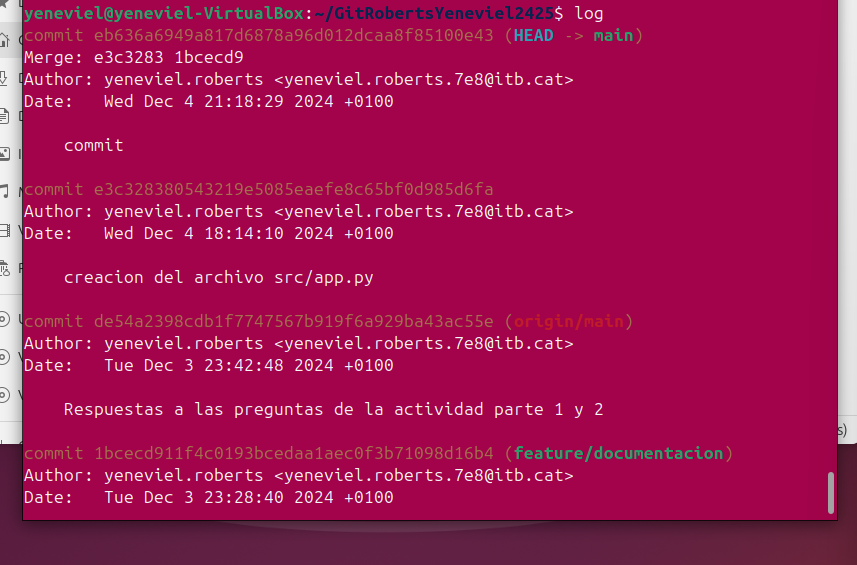

